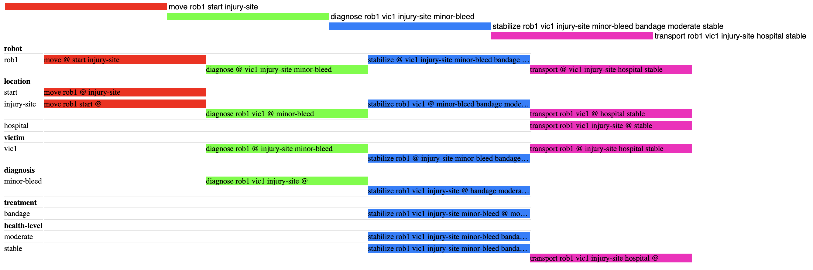
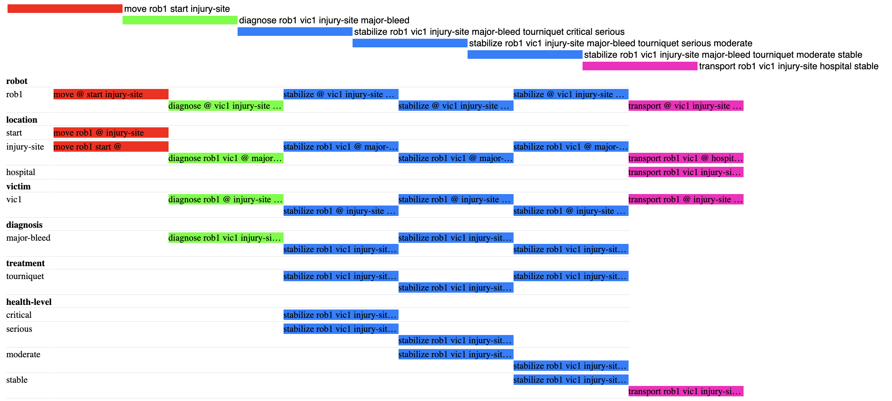
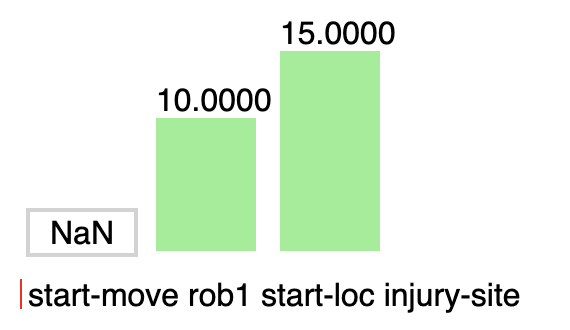
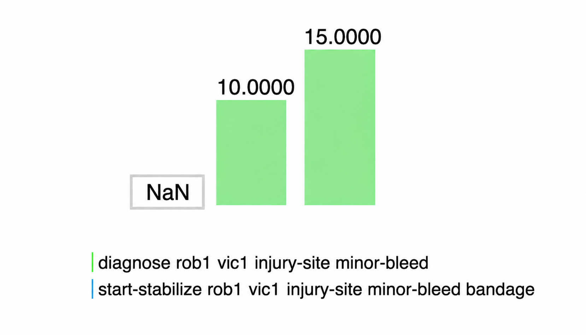
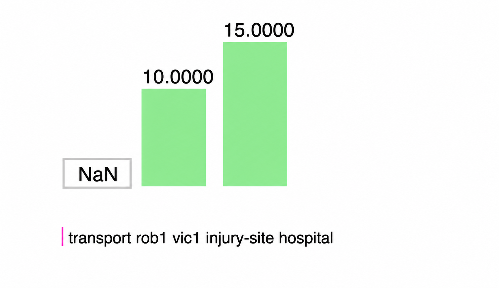

# Assignment D4-V7: Search and Rescue – Victim Health and Treatment Constraints
The following assignment will look at how to plan actions for a robot to treat victims depending on the severity and diagnosis of their injury. After stabilizing the victim, the robot should then transport the victim from the location of the injury.   

Planning Domain Definition Language will be used to do create plans for this procedure. Initially, basic PDDL will be applied and then the task is expanded through the use of PDDL+. 

## Initializations
Certain parameters are set initially when trying to plan. 
The **locations** are:  
```text
Starting Location   (Initial position of robot)  
injury-site         (Initial position of victim)
hospital            (safe evacuation point to which the victim is transported)
```
The task is divided into **two problems** with two different levels of injury with corresponding treatments:

```text
Mild Injury     - Minor Bleed  
Treatment       - Bandage 
Critical Injury - Major Bleed   
Treatment       - Tourniquet
```
Additionally, the task has been limited to **one** robot and **one** victim. 

## PDDL
When solving the task using the basic PDDL model the health of the victims are described by discrete levels. These span from:    
`critical` -> `serious` -> `moderate` -> `stable`   
The robot will reach the victim, diagnose them and treat them until the victim has progressed to the state `stable`. Only then can the robot transport the victim to the hospital. For the case of a mild injury this meant that the victim is initally in a state of `moderate` injury, whereas the critical injury implies a `critical` injury.

The structure in which the plan is executed is determined by the **actions**:
```text
move      - robot moving from A to B
diagnose  - diagnosing the victim
stabilize - stabilizing the victim
transport - robot transporting the victim
```

**RESULTS**  
After running the LAMA-FIRST planner on the mild injury the following plan was outputted:  

As the image depicts the robot uses 4 steps to get to the victim, diagnoze them, stabilize them and then transport them to the hospital.   

The plan for the critical injury:

It becomes clear that a more severe injury requires more steps of stabilization. Here the process of getting the victim to the hospital requires 6 steps. 

Although the severity of the injury is large, the planner is able to find a solution which brings the victim safely to the hospital. However, this representation might not always be entirely realistic. This is when the expansion to PDDL+ can be helpful.

## PDDL +
When expanding to PDDL+ the health of the victim is no longer represented by discrete values, but as a continuous value. As time passes the victim's health will decrease and they are therefore dependent on the time it takes for the robot to reach the victim and stabilize them.   

There are therefore some new values added to this part of the assignment - the time each action/process takes. The **processes** of the task are:
```text
health-decay          - for each time unit the health declines at a certain rate.  
moving-process        - moving from A to B takes the same time as the distance required.  
stabilization-process - takes 5 time units to stabilize victim
``` 

There are also actions as for the PDDL case:
```text
diagnose  - happens simultaneously as stabilizing and takes 1 time unit.  
transport - transporting the victim. 
```
The transport action has not been modeled with any time-units as the action does not affect the health-decay because the victim is stabilized.

**Problem 1 - Mild Injury**

For the first problem the injury is the same as for the mild injury with PDDL:
```text
Mild Injury - Minor Bleed 
Treatment - Bandage
```
Additionally the parameters for inital health has been set:  
```text
health = 90  
worsening-rate = 1
```
This indicates that the victim is at good health, with a slight deteriation due to the minor bleed. 

The following plan was given to treat the victim:


<table>
<tr>
<td align="center">
<br>
t = 0
</td>

<td align="center">
<br>
t = 10
</td>

<td align="center">
<br>
t = 15
</td>
</tr>
</table>


## DISCUSSION

**LIMITATIONS**

diagnose is given directly in init

simplified by using actions as well as processes for PDDL+